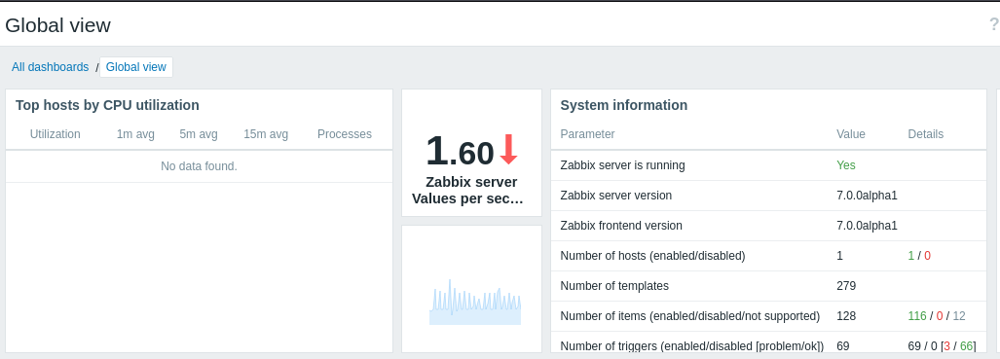

# HTB — Watcher

Linux box running Zabbix behind a vhost. Foothold via Zabbix, root via database creds.

> Secrets (session IDs, DB password) from the original notes are redacted below —
> the box is public, but no reason to publish live-looking credentials.

## Recon

<!-- meta: technique=port-scanning -->
```bash
nmap -sSCV -p0- -oA tcp_full 10.129.194.72
```
<!-- output -->
```
22/tcp     open  ssh   OpenSSH 8.9p1 Ubuntu
80/tcp     open  http  Apache 2.4.52  -> redirects to http://watcher.vl/
10050/tcp  open  tcpwrapped
10051/tcp  open  tcpwrapped
40291/tcp  open  java-rmi
```

## Subdomain / vhost enumeration

Fuzz the `Host` header, filtering out the default response size:

<!-- meta: technique=subdomain-enumeration -->
```bash
ffuf -w /usr/share/seclists/Discovery/DNS/subdomains-top1million-5000.txt -u http://10.129.234.163 -H "Host: FUZZ.watcher.vl" -fs 4991
```
<!-- output -->
```
zabbix   [Status: 200, Size: 3946]
```

## Foothold

Log into Zabbix with the guest account to fingerprint the version.



## Root

Read `/etc/passwd` to identify shell users (`ubuntu`, `root`):

<!-- meta: technique=privesc-enum -->
```bash
cat /etc/passwd
```

Zabbix config on disk exposes the database credentials:

<!-- meta: technique=privesc-enum -->
```bash
cat /usr/share/zabbix/conf/zabbix.conf.php
```
<!-- output -->
```
$DB['TYPE']     = 'MYSQL';
$DB['USER']     = 'zabbix';
$DB['PASSWORD'] = '<redacted>';
```
